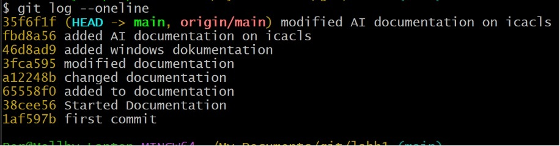

# **Per Lindberg, 27-09-26, ISCXS26, Labbenvironment, Git, CLI och AI**

# Labenvironment: 
Oracle VrtualBox with one Windows 11 and one Ubuntu 25 virtual machines connected to a NAT Network (Labnet) - (host-only malfunctioned in my Oracle setup so I chose NAT)

# Network settings

| Hostname | OS         | IP-Adress    | Netmask       | Gateway     |
|----------|------------|--------------|---------------|-------------|
| Win11    | Windows 11 | 192.168.1.50 | 255.255.255.0 | 192.168.1.1 |
| Ubuntu   | Ubuntu 25  | 192.168.1.51 | 255.255.255.0 | 192.168.1.1 |

# Commands
**Linux**

**Create folder**

```bash
vboxuser@Ubuntu:~$ sudo mkdir /var/systementor
```

```bash
vboxuser@Ubuntu:~$ sudo mkdir /var/systementor/konsultdata
```

**Create file**

```bash
vboxuser@Ubuntu:~$ sudo touch /var/systementor/konsultdata/anteckningar.txt
```

**Create group "konsulter"**

```bash
vboxuser@Ubuntu:~$ sudo addgroup konsulter
```

**Change owner of folder konsultdata to group**

```bash
vboxuser@Ubuntu:~$ sudo chmod -750 /var/systementor/konsultdata/
```

**Give group "konsulter" write privelige to file anteckningar.txt**

```bash
vboxuser@Ubuntu:~$ sudo chmod -R 640 /var/systementor/konsultdata/anteckningar.txt
```

**Verify priveliges**

```bash
vboxuser@Ubuntu:/var/systementor/konsultdata$ ls -al
total 8
d----w-r-x 2 root konsulter 4096 Oct  1 21:35 .
drwxr-xr-x 3 root root      4096 Oct  1 21:34 ..
-rw-r----- 1 root konsulter    0 Oct  1 21:35 anteckningar.txt
vboxuser@Ubuntu:/var/systementor/konsultdata$
```

**Verify network connection to win11 box**

```bash
vboxuser@Ubuntu:/var/systementor/konsultdata$ ping 192.168.1.50
PING 192.168.1.50 (192.168.1.50) 56(84) bytes of data.
^C      
--- 192.168.1.50 ping statistics ---
388 packets transmitted, 0 received, 100% packet loss
```

Win11 firewall blocks ICMP as standard.
Run `Set-NetFirewallRule -Name CoreNet-Diag-ICMP4-EchoRequest-In -enabled True` in Powershell as admin in windows11 machine to allow inbound ICMP.

**Try ping again**
```bash
vboxuser@Ubuntu:/var/systementor/konsultdata$ ping 192.168.1.50
PING 192.168.1.50 (192.168.1.50) 56(84) bytes of data.
64 bytes from 192.168.1.50: icmp_seq=1 ttl=128 time=3.31 ms
64 bytes from 192.168.1.50: icmp_seq=2 ttl=128 time=2.08 ms
64 bytes from 192.168.1.50: icmp_seq=3 ttl=128 time=2.00 ms
64 bytes from 192.168.1.50: icmp_seq=4 ttl=128 time=4.09 ms
64 bytes from 192.168.1.50: icmp_seq=5 ttl=128 time=2.18 ms
^C
--- 192.168.1.50 ping statistics ---
5 packets transmitted, 5 received, 0% packet loss, time 4014ms
rtt min/avg/max/mdev = 2.000/2.729/4.085/0.829 ms
```

**Verify network adapter settings**

```bash
vboxuser@Ubuntu:/var/systementor/konsultdata$ ip addr show
1: lo: <LOOPBACK,UP,LOWER_UP> mtu 65536 qdisc noqueue state UNKNOWN group default qlen 1000
    link/loopback 00:00:00:00:00:00 brd 00:00:00:00:00:00
    inet 127.0.0.1/8 scope host lo
       valid_lft forever preferred_lft forever
    inet6 ::1/128 scope host noprefixroute 
       valid_lft forever preferred_lft forever
2: enp0s3: <BROADCAST,MULTICAST,UP,LOWER_UP> mtu 1500 qdisc fq_codel state UP group default qlen 1000
    link/ether 08:00:27:2a:3c:43 brd ff:ff:ff:ff:ff:ff
    inet 192.168.1.51/24 brd 192.168.1.255 scope global noprefixroute enp0s3
       valid_lft forever preferred_lft forever
    inet6 fe80::d639:6b45:b6dd:4259/64 scope link noprefixroute 
       valid_lft forever preferred_lft forever
vboxuser@Ubuntu:/var/systementor/konsultdata$
```

**Windows**

Open powershell as admin

**Create directory c:\sytementor\konsultdata**

```
PS C:\WINDOWS\system32> mkdir c:\Systementor\konsultdata


    Directory: C:\Systementor


Mode                 LastWriteTime         Length Name
----                 -------------         ------ ----
d-----         10/2/2026   1:56 AM                konsultdata


PS C:\WINDOWS\system32>
```

**Get ACL**

```
PS C:\WINDOWS\system32> get-acl c:\Systementor\konsultdata


    Directory: C:\Systementor


Path        Owner                  Access
----        -----                  ------
konsultdata BUILTIN\Administrators BUILTIN\Administrators Allow  FullControl...


PS C:\WINDOWS\system32>
```

**Verify network connectivity to Ubuntu (192.168.1.51)**

```
PS C:\WINDOWS\system32> ping 192.168.1.51

Pinging 192.168.1.51 with 32 bytes of data:
Reply from 192.168.1.51: bytes=32 time=2ms TTL=64
Reply from 192.168.1.51: bytes=32 time=1ms TTL=64
Reply from 192.168.1.51: bytes=32 time=2ms TTL=64
Reply from 192.168.1.51: bytes=32 time=1ms TTL=64

Ping statistics for 192.168.1.51:
    Packets: Sent = 4, Received = 4, Lost = 0 (0% loss),
Approximate round trip times in milli-seconds:
    Minimum = 1ms, Maximum = 2ms, Average = 1ms
PS C:\WINDOWS\system32>
```

**Display Network configuration**

```
PS C:\WINDOWS\system32> ipconfig /all

Windows IP Configuration

   Host Name . . . . . . . . . . . . : Win11
   Primary Dns Suffix  . . . . . . . :
   Node Type . . . . . . . . . . . . : Hybrid
   IP Routing Enabled. . . . . . . . : No
   WINS Proxy Enabled. . . . . . . . : No

Ethernet adapter Ethernet:

   Connection-specific DNS Suffix  . :
   Description . . . . . . . . . . . : Intel(R) PRO/1000 MT Desktop Adapter
   Physical Address. . . . . . . . . : 08-00-27-C1-14-36
   DHCP Enabled. . . . . . . . . . . : No
   Autoconfiguration Enabled . . . . : Yes
   Link-local IPv6 Address . . . . . : fe80::dc8a:ba1d:7871:99fb%5(Preferred)
   IPv4 Address. . . . . . . . . . . : 192.168.1.50(Preferred)
   Subnet Mask . . . . . . . . . . . : 255.255.255.0
   Default Gateway . . . . . . . . . : 192.168.1.1
   DHCPv6 IAID . . . . . . . . . . . : 84410407
   DHCPv6 Client DUID. . . . . . . . : 00-01-01-00-32-2A-13-74-08-00-27-C1-14-36
   DNS Servers . . . . . . . . . . . : 8.8.8.8
   NetBIOS over Tcpip. . . . . . . . : Enabled
PS C:\WINDOWS\system32>
```

# AI-log and evaluation:

I asked chatgpt [chatgpt](https://chatgpt.com/) to explain the windows icacls command

```
explain icacls usage
```
Chatgpt generated the following response

```
icacls command in Windows

icacls is a Windows Command Prompt command used to view and modify file and folder permissions. It is especially useful for managing NTFS permissions.
Basic syntax

icacls <file-or-folder> [options]

1. View permissions

To see the permissions of a file:

icacls report.txt

Example output:

report.txt BUILTIN\Administrators:(I)(F)
            NT AUTHORITY\SYSTEM:(I)(F)
            John:(I)(M)

Common permission codes:
Code	Meaning
F	Full control
M	Modify
RX	Read and execute
R	Read
W	Write
D	Delete

(I) means the permission is inherited from the parent folder.
2. Grant permission

For example, give user John read and execute permission:

icacls report.txt /grant John:RX

Give John full control:

icacls report.txt /grant John:F

Common /grant permissions

/g user:R
/g user:W
/g user:RX
/g user:M
/g user:F

/g is a shorter form of /grant.
3. Remove a user's permission

icacls report.txt /remove John

This removes the explicitly assigned permission for John.
4. Deny permission

You can explicitly deny access:

icacls report.txt /deny John:W

This denies John write permission.

Be careful with /deny, because explicit deny permissions can override otherwise allowed permissions and make troubleshooting more difficult.
5. Apply permissions to a folder and its contents

Suppose you have:

C:\Projects

To grant John read/execute access to the folder and its files/subfolders:

icacls C:\Projects /grant John:RX /T

/T means process all matching files and subdirectories.
6. Inheritance

NTFS permissions can be inherited from a parent folder.
Disable inheritance

icacls C:\Projects /inheritance:d

d means disable inheritance but copy the inherited permissions as explicit permissions.

Another option:

icacls C:\Projects /inheritance:r

r removes inherited permissions.
Enable inheritance again

icacls C:\Projects /inheritance:e

e enables inheritance.
7. Copy permissions

You can copy an ACL from one file to another:

icacls file1.txt /save permissions.txt

Then restore those permissions elsewhere:

icacls file2.txt /restore permissions.txt

This is useful when you need to back up or reproduce permissions.
8. Reset permissions

A very useful command is:

icacls C:\Projects /reset /T

This resets permissions to the default inherited permissions for the files and folders.

Be careful: this changes existing permissions, so don't use /reset on important data without understanding the consequences.
Example scenario

Imagine:

C:\Company
├── Public
└── Private

You want John to read the Public folder:

icacls C:\Company\Public /grant John:RX /T

You want John to modify files in Private:

icacls C:\Company\Private /grant John:M /T

You can then verify the result:

icacls C:\Company\Private

Useful commands to remember

icacls file.txt

View permissions

icacls file.txt /grant John:R

Grant read permission

icacls file.txt /grant John:M

Grant modify permission

icacls file.txt /remove John

Remove John's explicit permission

icacls folder /grant John:RX /T

Grant permission recursively

icacls folder /inheritance:e

Enable inheritance

icacls folder /reset /T

Reset permissions recursively

For experimenting, it's best to practice icacls on a test folder, because incorrect ACL changes can prevent users—including yourself—from accessing files.
```

I used the official documentation from microsofts site [icacls](https://learn.microsoft.com/en-us/windows-server/administration/windows-commands/icacls) and I could not find any faults in the description or the examples.
The warnings that chatgpt are correctly reported and are valid.

I verified some examples that chatgpt gave and verified that the results are as expected.

```
S C:\Systementor\konsultdata> get-acl .\report.txt


    Directory: C:\Systementor\konsultdata


Path       Owner     Access
----       -----     ------
report.txt WIN11\per BUILTIN\Administrators Allow  FullControl...


PS C:\Systementor\konsultdata> icacls report.txt /grant John:F
processed file: report.txt
Successfully processed 1 files; Failed processing 0 files
PS C:\Systementor\konsultdata> get-acl .\report.txt


    Directory: C:\Systementor\konsultdata


Path       Owner     Access
----       -----     ------
report.txt WIN11\per WIN11\John Allow  FullControl...


PS C:\Systementor\konsultdata>
```

I also asked chatgpt the same question about the cacls command [cacls](https://learn.microsoft.com/en-us/windows-server/administration/windows-commands/cacls) (which is depreceated) and chatgpt reported this correctly as depreceated but still gave me a full explanation as it can still exist in older applications such as scripts etc.


# Gitlog

